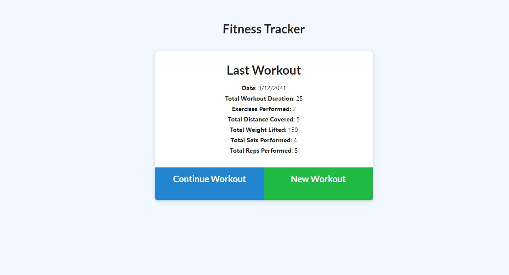
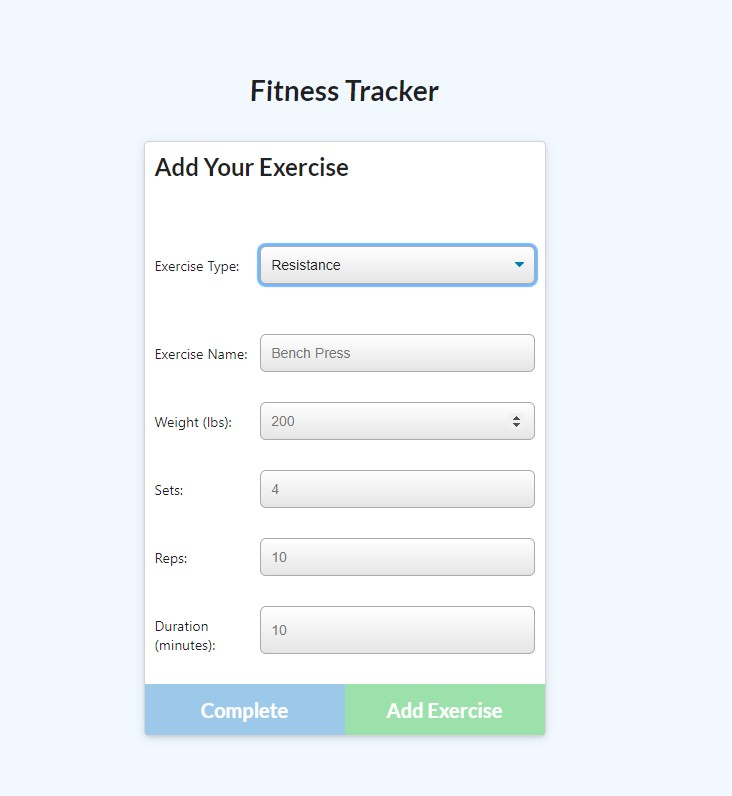
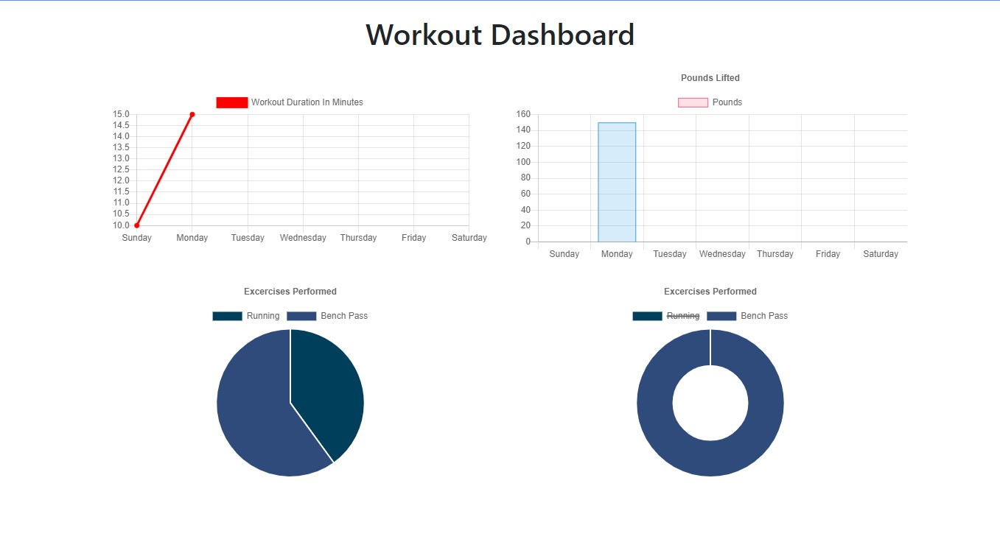

<link rel="stylesheet" href="https://use.fontawesome.com/releases/v5.8.1/css/all.css"
        integrity="sha384-50oBUHEmvpQ+1lW4y57PTFmhCaXp0ML5d60M1M7uH2+nqUivzIebhndOJK28anvf" crossorigin="anonymous" />

<h1 style="align:center;margin:2%">                        🏋️‍♀️ Fitness/Workout Tracker 🏋🏾‍♂️</h1>

<h1>Description</h1>

    This application can be used help user to track daily workout/exercise. All information will be saved and user will be able to continue to exercise where they left.
    A consumer will reach their fitness goals more quickly when they track their workout progress.

<h1> Table of Contents </h1>

* [Demo](#Demo)

* [Installation](#installation)
  
* [Usage](#usage)

* [License](#license)

 
* [Questions](#Questions)

## Demo:

## Installation:
    1️⃣ Clone repository to your local ✔
    2️⃣ Run npm packages in (package.json) file ✔
    3️⃣ Run Npm run seed(seeders folder❗️) to create user to your local mongoDB database ✔
    4️⃣ Run 'Node server' or 'npm start' to start application ✔
##  Usage:
    1️⃣ After running server ✔
    2️⃣ Choose a type of exercise that you want to do ✔
    3️⃣ You have to fill atleast type exercise,name of exercise and duration time ❗️    
    4️⃣ Save your exercise/workout ✔
    5️⃣ Be able to see all work by clicking dasboard ✔

##  License:
    This project is licensed under the MIT license.

    For more information about the license, click on the link below.

<h1>

  

©  

</h1>

## ☆ Questions:
   
<h1>
     For questions ❓ 

                              

⇨ [][1][][2] ⇦  

[1]: https://github.com/fatihay53
[2]: https://www.linkedin.com/in/fatih-sultan-ay-211689181/

</h1>
